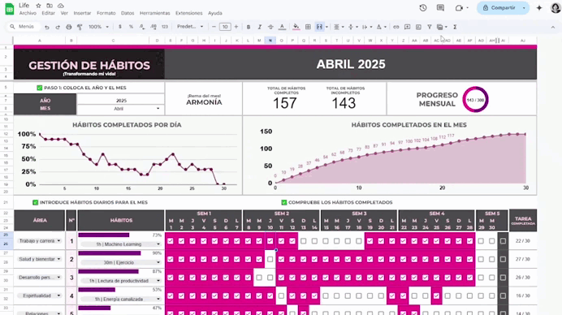

# 📊 Habit Tracker en Google Sheets – Optimiza tu tiempo con *Make Time*  

Bienvenido al repositorio del **Habit Tracker Dashboard en Google Sheets**, una herramienta sencilla pero poderosa para **gestionar hábitos y enfocar actividades** siguiendo la metodología *Make Time*. Este proyecto permite estructurar tu día, priorizar tareas clave y hacer un seguimiento visual de tu progreso, todo desde una hoja de cálculo accesible y eficiente.  

## 🚀 Características principales  
- **Definición de Highlight diario**: Identifica la actividad más importante del día para maximizar tu enfoque.  
- **Registro y seguimiento de hábitos**: Monitorea el cumplimiento de tus rutinas con tablas dinámicas y gráficos.  
- **Análisis de productividad**: Obtén estadísticas sobre el tiempo dedicado a cada hábito y ajusta tu enfoque.  
- **Automatización con funciones de Google Sheets**: Uso de fórmulas y scripts para mejorar la experiencia sin necesidad de herramientas externas.  

## 🎯 ¿Por qué Make Time?  
La metodología *Make Time*, creada por Jake Knapp y John Zeratsky, se centra en **estrategias prácticas para eliminar distracciones y focalizar lo que realmente importa**. Inspirada en sus principios desarrolle una herramienta accesible que cualquiera puede adaptar a su rutina.  

## ⚙️ Tecnologías utilizadas  
- **Google Sheets** (estructura y almacenamiento de datos)  
- **Google Apps Script** (automatización y personalización)  
- **Gráficos y tablas dinámicas** (visualización de progreso)  

## 🚧 Estado del proyecto  
Actualmente en fase de desarrollo inicial. Se aceptan contribuciones, sugerencias y feedback para mejorar la funcionalidad y diseño del sistema.  

## Vista previa del Habit Tracker

  
*Image 1. Gestionador de hábitos*

📌 **¿Listo para optimizar tu rutina y hacer que tu tiempo cuente?** ¡Explora, colabora y transforma tu día con hábitos efectivos! 💡⏳  

